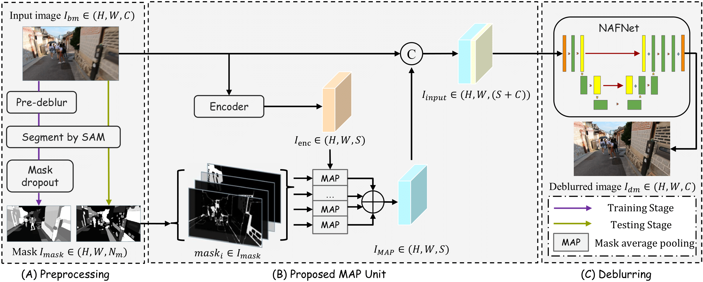

## SAM-Deblur: Let Segment Anything Boost Image Deblurring
---

Implementation of the paper [SAM-Deblur: Let Segment Anything Boost Image Deblurring(ICASSP2024)](https://hplqaq.github.io/projects/sam-deblur)

##### [Siwei Li](https://hplqaq.github.io/)\*, [Mingxuan Liu](https://arktis2022.github.io/)\*, Yating Zhang, Shu Chen, [Haoxiang Li](https://lihaoxiang-20.github.io/), Zifei Dou, [Hong Chen](http://hongchen.ime.tsinghua.edu.cn/)

[[`Project`](https://hplqaq.github.io/projects/sam-deblur)] [[`Paper`](https://arxiv.org/abs/2309.02270v2)] [[`BibTeX`](https://hplqaq.github.io/projects/sam-deblur.assets/bib_sam_deblur.txt)]



Todo:
- [x] Full code release with instruction
- [x] Training and testing options
- [x] Pretrained models and prepared data
- [x] Instructions for data preparation code

### Installation
This implementation is based on [BasicSR](https://github.com/xinntao/BasicSR) which is an open source toolbox for image/video restoration tasks.

```python
python 3.10.13
pytorch 1.13.1
cuda 11.7
```

```
conda create -n sam-deblur python=3.10
conda activate sam-deblur
conda install pytorch==1.13.1 torchvision==0.14.1 torchaudio==0.13.1 pytorch-cuda=11.7 -c pytorch -c nvidia
```

```
git clone https://github.com/HPLQAQ/SAM-Deblur.git
cd SAM-Deblur
pip install -r requirements.txt
pip install -e .
```
### Prepare Data and Pre-trained Models

Download pre-trained models for experiments from [Baidu Netdisk](https://pan.baidu.com/s/109TCMu7_ZuedUz8qG-Q0IQ?pwd=hplv)|[Onedrive](https://1drv.ms/f/s!Ar-cR-XYHDTtgt8yuujyjIENc_B11g?e=LzoHrG).  
Put under **experiments/pretrained_models**.

Download prepared data for experiments from [Baidu Netdisk](https://pan.baidu.com/s/1jHgwKqFuyyy8yixByiEfCg?pwd=hplv)|[Onedrive](https://1drv.ms/f/s!Ar-cR-XYHDTtgt8pYy2MBqQvroXl-Q?e=U7o4xc).  
If you only want to run our deblur pipeline, download test/val datasets(GoPro, RealBlurJ, REDS, ReLoBlur provided). if you want to train the model yourself, download train datasets(GoPro provided). Check [datasets README](datasets/README.md) for standard dataset structure.
Unzip data and put under **datasets** dir for experiments.

Prepared data comes from original datasets which are processed using code under **scripts/data_preparation**. *Use datasets uploaded above and your don't have to run the scripts your self.*
- **scripts/data_preparation/1_create_masks_with_sam.py**: Create masks for concat method.
- **scripts/data_preparation/2_masks_to_grouped_masks.py**: Create grouped_masks from masks for our MAP method.
- **scripts/crop_\*\*\***: Create crops from inputs for training.
- **scripts/lmdb_\*\*\***: Create lmdb from original disk for faster data loading. (not necessary)

### Quick Start

Test the pretrained model on REDS(can be any of the four datasets) with follow command. Visualization will be under directory **results**.

```
python basicsr/test.py -opt options/test/REDS/SegNAFNet.yml
```

Options' corresponding method see [pretrained_models README](experiments/pretrained_models/README.md)

Detailed instructions under [scripts/test.md](scripts/test.md).  
To train model, follow instructions under [scripts/train.md](scripts/train.md).

The core implementation is at [SegNAFNet_arch.py](basicsr/models/archs/SegNAFNet_arch.py)

### Results

Best results are highlighted in bold. **w/o SAM**: Not using SAM priors, **CAT**: concatenation method, **MAP**: Using SAM-Deblur framework w/o mask dropout, **Ours**: Using SAM-Deblur framework.  
**Mode Collapse Rate** (MCR) is calculated using a threshold-based method. Specifically, when \\( PSNR(I_bm, I_gt) - PSNR(I_dm, I_gt) > 3 \\) (where \\( I_gt \\) is the ground truth), we consider the model to have undergone "mode collapse". A lower MCR suggests stronger generalization capabilities of the model.

| Methods | GoPro (PSNR↑ / SSIM↑) | RealBlurJ (PSNR↑ / SSIM↑ / MCR↓) | REDS (PSNR↑ / SSIM↑ / MCR↓) | ReLoBlur (PSNR↑ / SSIM↑ / MCR↓) |
|---------|-----------------------|----------------------------------|-----------------------------|---------------------------------|
| w/o SAM | 32.85 / 0.960         | 26.57 / 0.866 / 0.20%           | 25.97 / 0.844 / 3.80%       | 25.26 / 0.687 / 54.68%         |
| CAT     | **32.88 / 0.961**     | 26.55 / 0.863 / 0.31%           | 26.65 / 0.865 / 2.57%       | 29.77 / 0.882 / 58.73%         |
| MAP     | 32.82 / 0.960         | 26.57 / 0.866 / 0.31%           | 26.81 / 0.865 / 0.40%       | 30.86 / 0.897 / 55.44%         |
| **Ours**| 32.83 / 0.960         | **26.62 / 0.867 / 0.00%**       | **26.93 / 0.868 / 0.20%**   | **32.29 / 0.903 / 13.92%**     |

### Citations
If SAM-Deblur helps your research or work, please consider citing SAM-Deblur.

```
@inproceedings{Li2023SAMDeblur,
  author       = {Siwei Li and
                  Mingxuan Liu and 
                  Yating Zhang and 
                  Shu Chen and 
                  Haoxiang Li and 
                  Zifei Dou and 
                  Hong Chen},
  title        = {SAM-Deblur: Let Segment Anything Boost Image Deblurring},
  booktitle    = {ICASSP 2024 - 2024 IEEE International Conference on Acoustics, Speech and Signal Processing (ICASSP)},
  year         = {2024}
  organization = {IEEE}
}
```

### Contact
If you have any questions, feel free to contact hplv@foxmail.com.

### License and Acknowledgement

This project is under the Apache 2.0 license based on [BasicSR](https://github.com/xinntao/BasicSR) which is under the Apache 2.0 license. Thanks to the codes from [NAFNet](https://github.com/megvii-research/NAFNet) and awesome Segment Anything Model from [segment-anything](https://github.com/facebookresearch/segment-anything).
